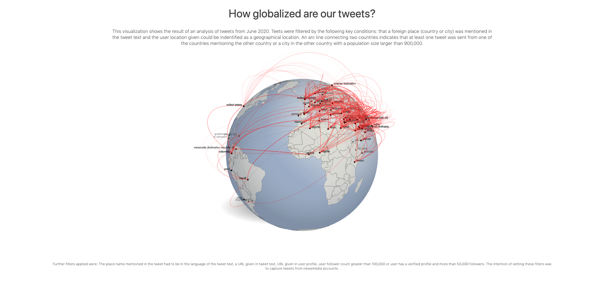

# 🐦🌏 Tweet globe 

Analysis of foreign country and citynames mentionend in Tweets of users with a certain followercount and given user location (in June 2020). 

hosted on heroku: https://twitter-globe.herokuapp.com/

### Data obtained from:
- [archiveteam-twitter-stream-2020-06](https://archive.org/details/archiveteam-twitter-stream-2020-06)
- [IP2Location™ City Multilingual Database](https://www.ip2location.com/free/city-multilingual)
- [IP2Location™ Country Multilingual Database](https://www.ip2location.com/free/country-multilingual)
- [queried from wikidata](https://query.wikidata.org/)

#### Globe basemap obtained from:
- [Faux-3d Shaded Globe](http://bl.ocks.org/dwtkns/4686432)

#### To do:
- connect to Twitter API
- dockerize

