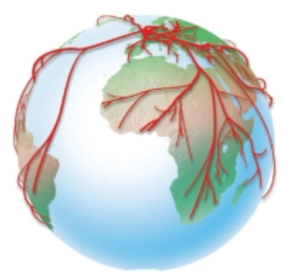

# 🌍 How globalized are our tweets?

 
 
 
 

##### Lara Schmitt
Spiced Academy Data Science Course - Final Project
Spearmint Vector Machine Cohorte 
2 November, 2020

---

## Motivation 

* Australia: the country of bushfires, sharks and kangaroos - that's all?

* Why do I know about the pandemic situation in France but not about it in Poland?

---
## Goal

* flowmap mapped to a globe to show about which countries a country reports 

---

## Data sources

* first idea: use API from news collection websites → rate limits
* twitter: news provider have twitter accounts 

---

# Tweet structure

---

# ⏩ Data pipeline

FLOWCHART 
for the tweet dump of June 2020:
json files → filter & get coordinates script → postgres db → dashboard

for the live dashboard:
twitter API scraping → filtering  ...

---

# 💻 Tech stack
* 🐍 **python**: data exploration and scraping
    * 🜁 sql alchemy
    * 🐼 pandas
    * 🔢 numpy 
    *  Psycopg2

* 🐘 **postgres** database
* 🍼 **flask**
* 🎨 **D3** for creating plots
* ☁️ heroku

---
# ⏰ Time spend 
* find data: `2 hours`

* getting ready and write load to DB function `3 days`
  
* write scraping script `1 afternoon`

* create flow map 

* set up dashboard and write SQL queries `loooong`

* set up flask `lllong`

* deploy on .... `shorter`

---

# 💡 What was exciting to learn?

* exploring tweets from around the world 
* setting up a whole pipeline on my own
* first insights in how to visualize with D3.js 
* creating a data-driven map [data-driven map ](https://twitter-globe.herokuapp.com/)

---

# Future plans
* 📝 rewrite my "insert_data" function 
* 🐳 dockerize 
* 🐦 connect to twitter API 

---
 

# Thanks, spiced & spearmints! 