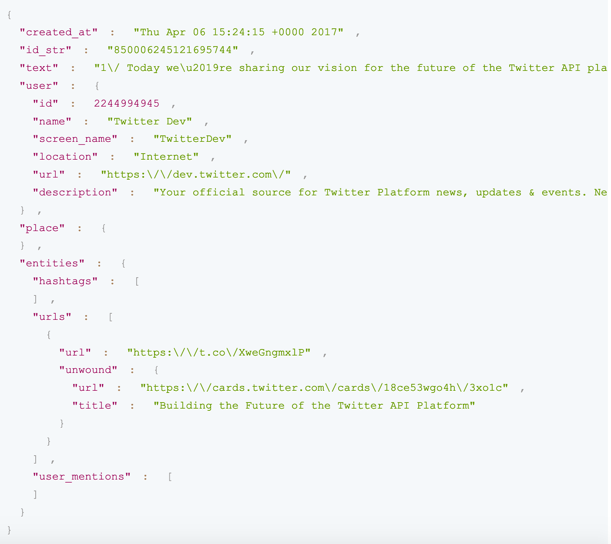

# 🌍 How globalized are our tweets?

<br>
<br>
<br>
<br>


##### Lara Schmitt
Spiced Academy Data Science Course - Final Project
Spearmint Vector Machine Cohorte 
2 November, 2020

---

## Motivation 

* Australia: the country of bushfires, sharks and kangaroos - that's all?

* Why do I know about the pandemic situation in France but not about it in Poland?

---
## Idea and Data

* flowmap mapped to a globe to show about which foreign countries a country reports 


<style>
img[alt~="center"] {
  display: block;
  margin: 0 auto
}
</style>


 

* first idea: use API from news collection websites → rate limits
* second idea: **twitter data**: news provider have twitter accounts 
* [**https://archive.org/**](https://archive.org/details/archiveteam-twitter-stream-2020-06)

---

###### 🐦 Tweet json

<style>
img[alt~="center"] {
  display: block;
  margin: 0 auto
}
</style>




---
# ⏳ Filter data

- ### generate lookup tables
- filter function:

```if url in tweet given and and user_url given and user_location given and (user verified and follower_count > 50000) or follower_count > 100000):
     loop through multilingual country list
            if countryname multilingual found in **tweet_text**: 
                if the found country in the tweet is a country in the language the tweet was written in:
                    get country coordinates
                  loop through multilingual country list:
                      if countryname multilingual found in **user_location**:
                          get user country coordinates
                  loop through multilingual city list:
                      if cityname multilingual found in user_location:
                          get city coordinates
                          get country of city coordinates
      
      loop through multilingual city list
            if ....
```


---

# ⏩ Data pipeline
 
json files → filter & get coordinates script → postgres db → flask reads from DB → flask produces some json routes → d3 consumes jsons and renders the data

(put a flowchart in here)


---

# 💻 Tech stack
* 🐍 **python**: data exploration, wrangling and db insert
     * 🐼 pandas
     * 🧙🏻‍♀️ sql alchemy
* 🐘 **postgres**: database
* ❓ **SQL**: query the DB
* 🧪 **flask**: python web framework
* 🎨 **D3.js**: visualization
* ☁️ **heroku**: hosting 


---
# ⏰ Time spend 

* find/ explore datasets: `1 day`

* write SPARQL queries `1 afternoon`

* **data wrangling**: explore/ combine/ alter lookup tables `3 days`

* **write function** to filter tweets and load to DB: `3-4 days`
  
* create globe visualization (with major help!) `1 morning`

* set up flask server `1 afternoon`

* deploy on heroku `1 afternoon`

---

# 💡 What was exciting to learn?

* exploring tweets from around the world 
* setting up a whole pipeline on my own
* first insights in how to visualize with D3.js 
* creating a [data-driven map](https://twitter-globe.herokuapp.com/)


---

# Future plans
* 📝 rewrite my giant "filter_and_insert_data" function 
* 🐳 dockerize 
* 🐦 connect to twitter API 
* ...

---
<br>

# Thanks, spiced & spearmints! 